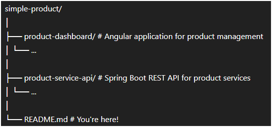

# simple-product

A monorepo for managing a basic product management system, built with a modern stack:

- **Frontend**: Angular (project name: `product-dashboard`)
- **Backend**: Spring Boot (project name: `product-service-api`)

This setup aims to provide a clear separation of concerns while keeping both frontend and backend projects organized within a single repository.

---

## 📁 Project Structure



---

## 🚀 Getting Started
### Prerequisites
- Node.js (v18+)
- Angular CLI (v19)
- Java (v21+)
- Springboot (3.4+)
- Maven

---

### Frontend: `product-dashboard`
#### Setup
```bash
cd product-dashboard
npm install
```

#### Run
```bash
ng serve
```

---

### Backend: `product-service-api`
#### Setup
```bash
cd product-service-api
./mvnw clean install
```

#### Run
```bash
./mvnw spring-boot:run
```
API will be available at http://localhost:8080/.

---

🤝 Contributing
Contributions are welcome! Please open issues or submit pull requests with improvements or bug fixes.
